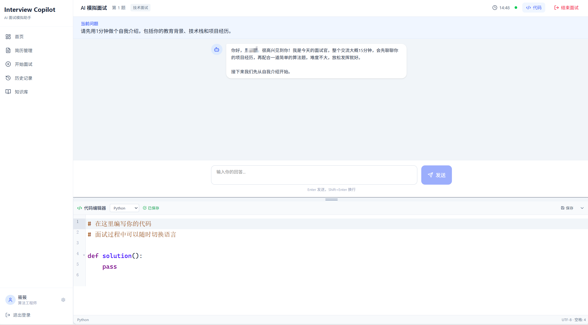
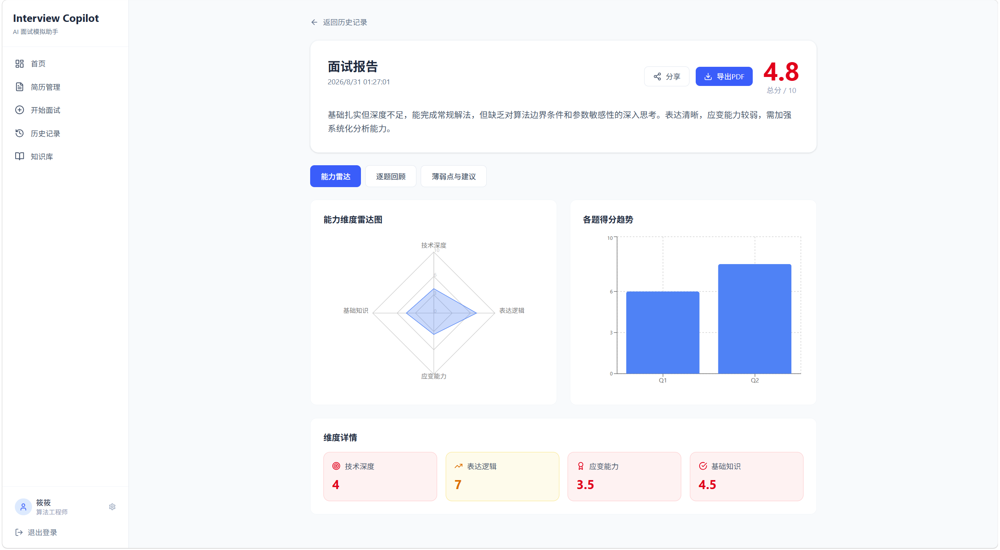
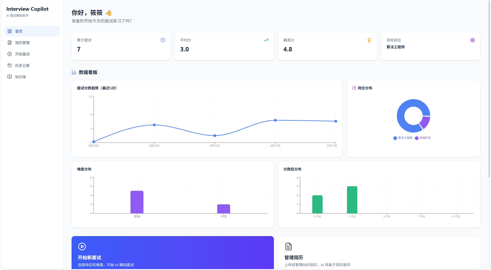
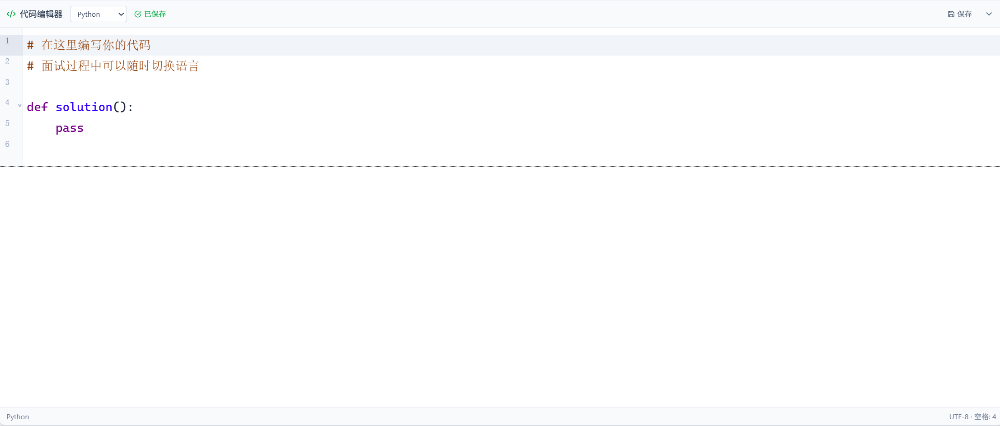

<div align="center">

# 🎯 Interview Copilot — AI 面试模拟助手

> 基于 LangGraph + FastAPI + React 的全栈 AI 面试模拟平台
> 
> 让 AI 扮演你的专属面试官，随时随地模拟练习、查漏补缺

[](https://www.python.org/)
[](https://fastapi.tiangolo.com/)
[](https://react.dev/)
[](https://www.typescriptlang.org/)
[](https://langchain-ai.github.io/langgraph/)
[](LICENSE)

[功能特性](#-功能特性) · [技术栈](#-技术栈) · [快速开始](#-快速开始) · [架构设计](#-架构设计) · [项目亮点](#-项目亮点)

</div>

---

## 📸 项目截图

| 面试房间 | 面试报告 |
|---------|---------|
|  |  |

| 数据看板 | 代码编辑器 |
|---------|-----------|
|  |  |

---

## ✨ 功能特性

### 🤖 AI 智能面试
- **LangGraph 状态机驱动**：8 个节点 + 条件边，模拟真实面试流程
- **智能追问机制**：AI 评估回答后自动识别薄弱点，生成针对性追问
- **多维度评分体系**：技术深度 / 表达逻辑 / 应变能力 / 基础知识 四维评分
- **流式输出**：WebSocket + 打字机效果，面试官问题逐字打出
- **面试官性格配置**：支持温和、严格、压力面等多种风格

### 💻 代码面试模式
- **在线代码编辑器**：基于 CodeMirror 6，支持 12 种编程语言
- **语法高亮 + 行号**：专业的代码编辑体验
- **可拖拽调整高度**：编辑器高度自由调节，自动记忆
- **AI 代码评审**：提交代码后 AI 自动评审，给出优化建议

### 📊 面试报告与数据分析
- **完整面试报告**：逐题回顾 + 评分 + 薄弱点分析 + 提升建议
- **雷达图可视化**：四维能力雷达图，直观展示优劣势
- **个人数据看板**：分数趋势、岗位分布、难度分布、分数段分布 4 大图表
- **报告导出 PDF**：一键导出，方便保存和分享
- **公开分享链接**：生成只读分享链接，无需登录即可查看

### 📝 简历与个人管理
- **简历上传解析**：支持 PDF / TXT 格式，自动提取关键信息
- **个人资料编辑**：昵称、目标岗位、毕业年份
- **目标岗位详情**：技术栈、目标公司、自定义岗位描述（JD）
- **历史记录管理**：面试历史列表，支持删除和回看

### 🔐 用户系统
- **注册 / 登录**：JWT 认证，安全可靠
- **密码加密**：bcrypt 哈希存储
- **多用户隔离**：每个用户的数据独立存储

---

## 🛠 技术栈

### 后端
| 技术 | 版本 | 用途 |
|------|------|------|
| **FastAPI** | 0.115+ | 异步 Web 框架，REST API + WebSocket |
| **LangGraph** | 0.2+ | Agent 状态图编排，面试流程核心 |
| **LangChain** | 0.3+ | LLM 应用框架 |
| **SQLAlchemy 2.0** | 2.0+ | 异步 ORM |
| **SQLite** | - | 关系型数据库（开发环境，零配置） |
| **Chroma** | 0.5+ | 向量数据库，RAG 知识库 |
| **WebSocket** | - | 实时通信 |
| **JWT + bcrypt** | - | 认证安全 |
| **Pydantic 2.0** | 2.9+ | 数据校验 |
| **DeepSeek API** | - | 大语言模型（性价比高） |

### 前端
| 技术 | 版本 | 用途 |
|------|------|------|
| **React** | 19 | UI 框架 |
| **TypeScript** | 5.5 | 类型安全 |
| **Vite** | 5.3 | 构建工具 |
| **Tailwind CSS** | 4.0 | 样式框架 |
| **Zustand** | 4.5 | 状态管理 |
| **React Router** | 6.26 | 路由 |
| **Recharts** | 2.12 | 数据可视化（雷达图、折线图、柱状图、饼图） |
| **CodeMirror 6** | 6.0 | 代码编辑器 |
| **Lucide React** | 0.400 | 图标库 |
| **Axios** | 1.7 | HTTP 客户端 |

---

## 🚀 快速开始

### 环境要求
- Python 3.11+
- Node.js 18+
- npm 9+

### 1. 克隆项目

```bash
git clone https://github.com/EdwinIN01/interview-copilot.git
cd interview-copilot
```

### 2. 启动后端

```bash
cd backend

# 创建虚拟环境
python -m venv venv

# 激活虚拟环境（Windows）
.\venv\Scripts\activate

# 激活虚拟环境（macOS/Linux）
source venv/bin/activate

# 安装依赖
pip install -r requirements.txt

# 配置环境变量
copy .env.example .env
# 编辑 .env，填入你的 DEEPSEEK_API_KEY

# 启动服务
uvicorn app.main:app --reload --host 0.0.0.0 --port 8000
```

后端启动后，访问 API 文档：http://localhost:8000/docs

### 3. 启动前端

```bash
cd frontend

# 安装依赖
npm install

# 启动开发服务器
npm run dev
```

前端启动后，访问：http://localhost:5173

### 4. 配置 LLM API Key

在 `backend/.env` 中配置：

```env
# DeepSeek（推荐，性价比高，国内可访问）
DEEPSEEK_API_KEY=sk-xxxxxxxxxxxxxxxx
DEEPSEEK_BASE_URL=https://api.deepseek.com/v1

# 或 OpenAI
# OPENAI_API_KEY=sk-xxxxxxxxxxxxxxxx
```

> 💡 **没有 API Key 也能运行**：AI 回复会使用内置 Mock 数据，方便测试界面和流程。

### 5. 一键启动（Windows）

项目根目录提供了 `start.bat` 脚本，双击即可同时启动前后端：

```bash
start.bat
```

---

## 📁 项目结构

```
interview-copilot/
├── backend/                          # 后端服务
│   ├── app/
│   │   ├── agent/                    # LangGraph 面试 Agent（核心）
│   │   │   ├── state.py              # 状态定义（TypedDict）
│   │   │   ├── graph.py              # 状态图构建（8节点+条件边）
│   │   │   ├── manager.py            # Agent 管理器
│   │   │   ├── llm.py                # LLM 封装（多提供商+Mock）
│   │   │   └── nodes/                # 8个图节点
│   │   │       ├── opening.py        # 开场节点
│   │   │       ├── question.py       # 提问节点（含 interrupt）
│   │   │       ├── evaluate.py       # 评估节点（Pydantic 解析+重试）
│   │   │       ├── followup.py       # 追问节点（含 interrupt）
│   │   │       ├── code_question.py  # 代码题节点
│   │   │       ├── reverse.py        # 反问节点
│   │   │       └── summary.py        # 总结+报告节点
│   │   ├── api/                      # REST API 路由
│   │   │   ├── auth.py               # 认证接口
│   │   │   ├── user.py               # 用户接口
│   │   │   ├── resume.py             # 简历接口
│   │   │   ├── interview.py          # 面试接口
│   │   │   └── knowledge.py          # 知识库接口
│   │   ├── ws/                       # WebSocket 实时通信
│   │   │   ├── handler.py            # WebSocket 处理器
│   │   │   └── connection_manager.py # 连接管理器
│   │   ├── rag/                      # RAG 知识库
│   │   │   └── retrieve.py           # 检索模块
│   │   ├── db/                       # 数据库
│   │   │   ├── base.py               # 基类
│   │   │   ├── session.py            # 会话管理
│   │   │   └── models/               # 数据模型
│   │   ├── schemas/                  # Pydantic 数据模型
│   │   ├── services/                 # 业务服务
│   │   ├── core/                     # 核心模块（安全/依赖/异常）
│   │   └── main.py                   # FastAPI 入口
│   ├── data/                         # 数据目录（数据库、上传文件）
│   ├── requirements.txt              # Python 依赖
│   ├── .env.example                  # 环境变量模板
│   ├── Dockerfile                    # Docker 部署配置
│   └── .dockerignore
├── frontend/                         # 前端应用
│   ├── src/
│   │   ├── pages/                    # 页面组件
│   │   │   ├── Login.tsx             # 登录页
│   │   │   ├── Register.tsx          # 注册页
│   │   │   ├── Dashboard.tsx         # 首页/数据看板
│   │   │   ├── CreateInterview.tsx   # 创建面试页
│   │   │   ├── InterviewRoom.tsx     # 面试房间（核心）
│   │   │   ├── Report.tsx            # 面试报告页
│   │   │   ├── History.tsx           # 历史记录页
│   │   │   ├── Resume.tsx            # 简历管理页
│   │   │   ├── Profile.tsx           # 个人资料页
│   │   │   ├── Knowledge.tsx         # 知识库页
│   │   │   └── ShareReport.tsx       # 公开分享页
│   │   ├── components/               # 通用组件
│   │   │   ├── Layout.tsx            # 布局组件
│   │   │   └── CodeEditor.tsx        # 代码编辑器组件
│   │   ├── stores/                   # Zustand 状态管理
│   │   │   ├── useAuthStore.ts       # 认证状态
│   │   │   └── useInterviewStore.ts  # 面试状态
│   │   ├── lib/                      # 工具库
│   │   │   ├── api.ts                # API 客户端
│   │   │   └── wsClient.ts           # WebSocket 客户端
│   │   ├── App.tsx                   # 应用根组件
│   │   ├── main.tsx                  # 入口文件
│   │   └── index.css                 # 全局样式
│   ├── public/                       # 静态资源
│   ├── index.html
│   ├── package.json
│   ├── tsconfig.json
│   ├── vite.config.ts
│   └── .env.production               # 生产环境变量模板
├── .gitignore
├── docker-compose.yml                # Docker Compose 部署
├── DEPLOY.md                         # 详细部署指南
├── start.bat                         # Windows 一键启动脚本
└── README.md
```

---

## 🏗 架构设计

### LangGraph 状态图（核心）

```
                    ┌──────────┐
                    │  START   │
                    └────┬─────┘
                         │
                    ┌────▼─────┐
                    │ opening  │  开场 + 自我介绍引导
                    └────┬─────┘
                         │
                    ┌────▼─────┐
         ┌─────────│ question │◄────────┐  提问（interrupt 等待回答）
         │         └────┬─────┘         │
         │              │               │
         │         ┌────▼─────┐         │
         │         │ evaluate │         │  评估回答（四维评分）
         │         └────┬─────┘         │
         │              │               │
         │    ┌─────────┼─────────┐     │
         │    │         │         │     │
         │    ▼         ▼         ▼     │
         │ ┌──────┐ ┌──────┐ ┌───────┐ │
         │ │follow│ │ code │ │reverse│ │  条件路由：
         │ │  up  │ │quest │ │       │ │  - 分数低 → 追问
         │ └──┬───┘ └──┬───┘ └───┬───┘ │  - 到代码题 → 代码题
         │    │         │         │     │  - 到反问环节 → 反问
         │    └─────────┴─────────┘     │  - 时间到/题数够 → 总结
         │              │               │
         │         ┌────▼─────┐         │
         └─────────│ evaluate │─────────┘  追问/代码题后再次评估
                   └────┬─────┘
                        │
                   ┌────▼─────┐
                   │ summary  │  总结 + 生成报告
                   └────┬─────┘
                        │
                   ┌────▼─────┐
                   │   END    │
                   └──────────┘
```

**核心机制**：
- `question` / `followup` 节点调用 `interrupt()` 暂停图，等待用户回答
- 用户通过 WebSocket 提交回答，`Command(resume=answer)` 恢复图执行
- `evaluate` 节点评估后，条件边根据分数、时间、题数决定下一步
- `Checkpoint` 自动持久化状态，支持断点续面
- 整个流程通过 WebSocket 实时推送，前端流式渲染

### 系统架构

```
┌─────────────────────────────────────────────────────────┐
│                        浏览器                              │
│  ┌──────────────┐  ┌──────────────┐  ┌──────────────┐  │
│  │  React 页面   │  │  CodeMirror  │  │  Recharts 图表│  │
│  └──────┬───────┘  └──────┬───────┘  └──────┬───────┘  │
│         │                  │                  │          │
│  ┌──────▼──────────────────▼──────────────────▼───────┐  │
│  │              Axios (REST API)                         │  │
│  │              WebSocket (实时通信)                      │  │
│  └──────────────────────────┬───────────────────────────┘  │
└─────────────────────────────┼───────────────────────────────┘
                              │ HTTP / WS
┌─────────────────────────────▼───────────────────────────────┐
│                        FastAPI 后端                            │
│  ┌──────────────┐  ┌──────────────┐  ┌──────────────────┐  │
│  │  REST API    │  │  WebSocket   │  │  LangGraph Agent  │  │
│  │  路由层       │  │  处理器       │  │  状态机（核心）    │  │
│  └──────┬───────┘  └──────┬───────┘  └────────┬─────────┘  │
│         │                  │                     │            │
│  ┌──────▼──────────────────▼─────────────────────▼─────────┐  │
│  │                    业务服务层                               │  │
│  │  用户服务 │ 简历服务 │ 面试服务 │ 报告服务 │ 知识库服务    │  │
│  └──────────────────────────┬───────────────────────────────┘  │
│                             │                                  │
│  ┌──────────────────────────▼───────────────────────────────┐  │
│  │                    数据访问层 (SQLAlchemy)                  │  │
│  └──────┬───────────────────────────────────┬───────────────┘  │
└─────────┼───────────────────────────────────┼──────────────────┘
          │                                   │
    ┌─────▼──────┐                     ┌─────▼──────┐
    │   SQLite    │                     │   Chroma    │
    │  关系数据库  │                     │  向量数据库  │
    └────────────┘                     └────────────┘
```

---

## 🌟 项目亮点

### 1. LangGraph 多节点状态机
- 不是简单的"提问-回答"循环，而是用状态图建模完整面试流程
- 8 个节点 + 条件边，支持开场、提问、评估、追问、代码题、反问、总结等环节
- 使用 `interrupt()` 实现人机协同，AI 等待用户回答后继续执行
- `Checkpoint` 状态持久化，支持断点续面

### 2. 智能追问与多维度评分
- AI 评估回答后，自动识别薄弱点并生成针对性追问
- 四维评分体系（技术深度、表达逻辑、应变能力、基础知识），用 Pydantic 结构化输出
- 评分结果驱动条件路由，实现"答得差就追问，答得好就下一题"的智能流程

### 3. 实时流式对话体验
- WebSocket 全双工通信，支持服务端主动推送
- LLM 流式输出，前端打字机效果渲染，体验接近真实对话
- 面试计时器、消息状态、代码编辑器等实时同步

### 4. 完整的数据闭环
- 从面试创建 → 实时对话 → 评分评估 → 报告生成 → 数据看板，形成完整闭环
- 个人数据看板用 4 种图表展示面试趋势，帮助用户发现自身薄弱环节
- 报告支持 PDF 导出和公开分享，方便复盘和请教他人

### 5. 工程化与可扩展性
- 前后端分离，REST API + WebSocket，接口规范
- 后端分层架构（API 层 → 服务层 → 数据层），代码清晰易维护
- LLM 提供商抽象，支持 DeepSeek / OpenAI 等多种模型，可无缝切换
- 数据库用 SQLAlchemy ORM，可从 SQLite 平滑迁移到 PostgreSQL

---

## 📡 API 概览

### 认证模块
| 方法 | 端点 | 说明 |
|------|------|------|
| POST | `/api/v1/auth/register` | 用户注册 |
| POST | `/api/v1/auth/login` | 用户登录 |
| GET | `/api/v1/auth/me` | 获取当前用户信息 |

### 用户模块
| 方法 | 端点 | 说明 |
|------|------|------|
| GET | `/api/v1/users/profile` | 获取个人资料 |
| PUT | `/api/v1/users/profile` | 更新个人资料 |
| GET | `/api/v1/users/stats` | 获取用户统计数据 |

### 简历模块
| 方法 | 端点 | 说明 |
|------|------|------|
| GET | `/api/v1/resumes` | 获取简历列表 |
| POST | `/api/v1/resumes/upload` | 上传简历 |
| GET | `/api/v1/resumes/{id}` | 获取简历详情 |
| PUT | `/api/v1/resumes/{id}` | 更新简历 |
| DELETE | `/api/v1/resumes/{id}` | 删除简历 |

### 面试模块
| 方法 | 端点 | 说明 |
|------|------|------|
| GET | `/api/v1/interviews` | 获取面试列表 |
| POST | `/api/v1/interviews` | 创建面试 |
| GET | `/api/v1/interviews/{id}` | 获取面试详情 |
| POST | `/api/v1/interviews/{id}/start` | 启动面试 |
| POST | `/api/v1/interviews/{id}/end` | 结束面试 |
| DELETE | `/api/v1/interviews/{id}` | 删除面试 |
| GET | `/api/v1/interviews/{id}/report` | 获取面试报告 |
| PUT | `/api/v1/interviews/{id}/code` | 保存代码 |
| POST | `/api/v1/interviews/{id}/share` | 生成分享链接 |
| GET | `/api/v1/interviews/share/{token}` | 查看公开分享报告 |

### 知识库模块
| 方法 | 端点 | 说明 |
|------|------|------|
| GET | `/api/v1/knowledge-bases` | 获取知识库列表 |
| POST | `/api/v1/knowledge-bases` | 创建知识库 |
| POST | `/api/v1/knowledge-bases/{id}/upload` | 上传学习资料 |

### WebSocket
| 端点 | 说明 |
|------|------|
| `/ws/interview/{id}` | 实时面试通信 |

---

## 📋 面试流程

1. **注册/登录** → 创建账号，登录系统
2. **上传简历** → 上传 PDF/TXT 简历，AI 自动提取关键信息
3. **设置目标岗位** → 在个人资料中设置目标岗位、技术栈、自定义 JD
4. **创建面试** → 选择岗位方向、难度、时长、面试官风格
5. **开始面试** → AI 开场，引导自我介绍
6. **技术问答** → AI 提问 → 用户回答 → AI 评估 → 智能追问 / 下一题
7. **代码题**（可选）→ 在线编码 → AI 代码评审
8. **反问环节** → 用户向 AI 面试官提问
9. **面试结束** → 生成完整报告（雷达图 + 逐题回顾 + 薄弱点 + 建议）
10. **复盘提升** → 查看数据看板，分析趋势，针对性练习

---

## 🐳 部署

### Docker Compose 一键部署

```bash
# 克隆项目
git clone https://github.com/EdwinIN01/interview-copilot.git
cd interview-copilot

# 配置环境变量
cd backend
copy .env.example .env
# 编辑 .env，填入 DEEPSEEK_API_KEY、JWT_SECRET 等

# 启动
cd ..
docker-compose up -d
```

访问：
- 前端：http://localhost:3000
- 后端 API：http://localhost:8000
- API 文档：http://localhost:8000/docs

### 其他部署方式

详细的 Vercel + Render、Zeabur、云服务器等部署方案请参考 [DEPLOY.md](DEPLOY.md)。

---

## ❓ 常见问题

### Q: 没有 API Key 能运行吗？
A: 可以。没有配置 API Key 时，系统会使用内置的 Mock 数据，AI 回复是预设的测试内容，方便测试界面和流程。要体验真实的 AI 面试，需要配置 DeepSeek 或 OpenAI 的 API Key。

### Q: DeepSeek API Key 怎么获取？
A: 访问 https://platform.deepseek.com 注册账号，在「API Keys」页面创建即可。新用户有免费额度，性价比很高，国内可直接访问。

### Q: 面试时 AI 不回复怎么办？
A: 请检查：1) 后端服务是否正常启动；2) `.env` 中的 API Key 是否正确；3) 网络是否能访问 DeepSeek API；4) 浏览器控制台是否有报错。

### Q: 数据存在哪里？会丢失吗？
A: 开发环境下，数据存在 `backend/data/interview.db`（SQLite 数据库文件）中。只要不删除这个文件，数据就不会丢失。建议定期备份这个文件。

### Q: 可以部署到线上吗？
A: 可以。项目提供了 Dockerfile 和 docker-compose.yml，可以部署到任何支持 Docker 的平台。详细部署方案请参考 [DEPLOY.md](DEPLOY.md)。

---

## 🤝 贡献

欢迎提交 Issue 和 Pull Request！

1. Fork 本仓库
2. 创建你的特性分支 (`git checkout -b feature/AmazingFeature`)
3. 提交你的修改 (`git commit -m 'Add some AmazingFeature'`)
4. 推送到分支 (`git push origin feature/AmazingFeature`)
5. 开启一个 Pull Request

---

## 📄 License

本项目基于 MIT 协议开源，详见 [LICENSE](LICENSE) 文件。

---

<div align="center">

如果这个项目对你有帮助，欢迎给个 ⭐ Star！

有问题欢迎提 Issue，或者联系作者。

</div>
